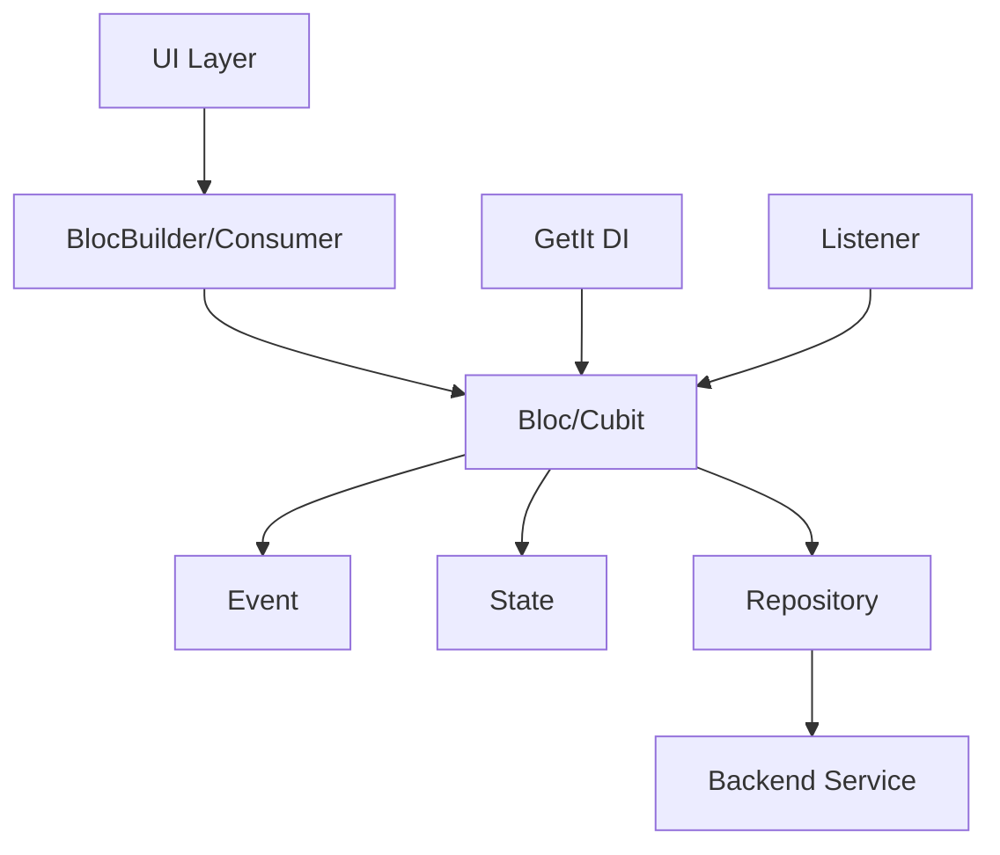
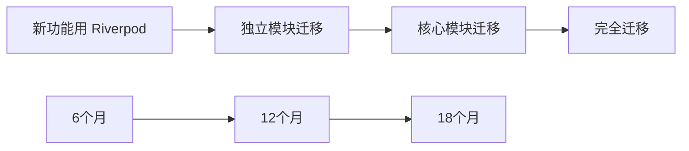

# AppFlowy Bloc to Riverpod 迁移深度分析报告

## 目录
1. [项目 Bloc 使用现状](#项目-bloc-使用现状)
2. [架构分析](#架构分析)
3. [迁移可行性评估](#迁移可行性评估)
4. [深度对比分析](#深度对比分析)
5. [迁移策略](#迁移策略)
6. [风险评估](#风险评估)
7. [最终建议](#最终建议)

---

## 项目 Bloc 使用现状

### 📊 统计数据

| 指标 | 数量 | 说明 |
|------|------|------|
| **Bloc/Cubit 类** | 106+ | 分布在各个功能模块 |
| **BlocProvider 使用** | 519+ | 包括 MultiBlocProvider |
| **BlocBuilder/Consumer/Listener** | 512+ | UI 层状态监听 |
| **Event/State 类** | 42+ | 事件驱动模式 |
| **受影响文件** | 283+ | 需要修改的文件 |

### 🏗️ 核心模块分布

#### 1. **应用层核心** (最高优先级)
```dart
// lib/startup/tasks/app_widget.dart
MultiBlocProvider(
  providers: [
    BlocProvider<CommandPaletteBloc>(...),
    BlocProvider<AppearanceSettingsCubit>(...),
    BlocProvider<NotificationSettingsCubit>(...),
    BlocProvider<DocumentAppearanceCubit>(...),
    BlocProvider.value(value: getIt<RenameViewBloc>()),
    BlocProvider.value(value: getIt<ActionNavigationBloc>()),
  ],
)
```

#### 2. **工作区管理**
- `WorkspaceBloc` - 工作区切换
- `ViewBloc` - 视图管理
- `FavoriteBloc` - 收藏功能
- `TabsBloc` - 标签页管理
- `SidebarBloc` - 侧边栏状态

#### 3. **数据库功能** (最复杂)
- `DatabaseBloc` - 数据库核心
- `GridBloc` - 表格视图
- `BoardBloc` - 看板视图
- `CalendarBloc` - 日历视图
- `FieldBloc` - 字段管理
- `CellBloc` 系列 - 单元格编辑

#### 4. **文档编辑器**
- `DocumentBloc` - 文档管理
- `DocumentSyncBloc` - 同步机制
- `PageStyleBloc` - 页面样式
- `AIWriterBloc` - AI 功能

#### 5. **AI 聊天**
- `ChatBloc` - `聊天主逻辑`
- `ChatMessageBloc` - 消息管理
- `ChatInputBloc` - 输入控制

---

## 架构分析

### 现有 Bloc 架构模式



### 典型 Bloc 实现案例

```dart
// 事件定义
@freezed
class ViewEvent with _$ViewEvent {
  const factory ViewEvent.initial() = Initial;
  const factory ViewEvent.rename(String name) = Rename;
  const factory ViewEvent.delete() = Delete;
}

// 状态定义
@freezed
class ViewState with _$ViewState {
  const factory ViewState({
    required ViewPB view,
    @Default(false) bool isLoading,
    @Default(false) bool isExpanded,
    FlowyResult<void, FlowyError>? result,
  }) = _ViewState;
}

// Bloc 实现
class ViewBloc extends Bloc<ViewEvent, ViewState> {
  ViewBloc({required this.view}) : super(ViewState.init(view)) {
    on<ViewEvent>((event, emit) async {
      await event.map(
        initial: (e) async => _handleInitial(emit),
        rename: (e) async => _handleRename(e.name, emit),
        delete: (e) async => _handleDelete(emit),
      );
    });
  }
}
```

### 依赖注入模式

```dart
// 使用 GetIt 进行依赖注入
getIt.registerFactory<ViewBloc>(() => ViewBloc(view: view));
getIt.registerLazySingleton<TabsBloc>(() => TabsBloc());
getIt.registerLazySingleton<RenameViewBloc>(() => RenameViewBloc());
```

---

## 迁移可行性评估

### ✅ 技术可行性：**可以实现**

Riverpod 完全可以替代 Bloc 的所有功能：

| 功能需求 | Bloc 实现 | Riverpod 替代方案 |
|---------|-----------|----------------|
| 状态管理 | BlocState | StateNotifier/AsyncNotifier |
| 事件处理 | BlocEvent | 直接方法调用 |
| 依赖注入 | GetIt + BlocProvider | Provider 全局访问 |
| 监听器 | BlocListener | ref.listen |
| 状态选择 | BlocSelector | ref.select |
| 测试 | bloc_test | Riverpod 原生测试 |

### ⚠️ 迁移复杂度：**极高**

基于代码分析，迁移复杂度远超预期：

1. **工作量评估**
   - 106+ Bloc/Cubit 类需要重写
   - 283+ 文件需要修改
   - 500+ Provider 注入点需要替换
   - 测试用例全部重写

2. **时间成本**
   - 预估需要 **3-6 个月**（全职开发）
   - 测试和调试额外 **1-2 个月**

3. **团队成本**
   - 全团队学习 Riverpod
   - 代码审查标准重建
   - 文档更新

---

## 深度对比分析

### 1. 代码复杂度对比

#### Bloc 模式（现有）
```dart
// 需要定义事件、状态、Bloc 三个部分
class TaskBloc extends Bloc<TaskEvent, TaskState> {
  TaskBloc() : super(TaskState.initial()) {
    on<LoadTasks>(_onLoadTasks);
    on<AddTask>(_onAddTask);
    on<UpdateTask>(_onUpdateTask);
    on<DeleteTask>(_onDeleteTask);
  }
  
  Future<void> _onLoadTasks(LoadTasks event, Emitter<TaskState> emit) async {
    emit(state.copyWith(isLoading: true));
    final result = await repository.loadTasks();
    result.fold(
      (tasks) => emit(state.copyWith(tasks: tasks, isLoading: false)),
      (error) => emit(state.copyWith(error: error, isLoading: false)),
    );
  }
}
```

#### Riverpod 模式（提议）
```dart
// 简化为一个 Provider
@riverpod
class TaskController extends _$TaskController {
  @override
  Future<TaskState> build() async {
    final tasks = await ref.watch(taskRepositoryProvider).loadTasks();
    return TaskState(tasks: tasks);
  }
  
  Future<void> addTask(Task task) async {
    state = const AsyncLoading();
    state = await AsyncValue.guard(() async {
      await ref.read(taskRepositoryProvider).addTask(task);
      return build();
    });
  }
}
```

**分析**：Riverpod 代码量减少约 **40-50%**

### 2. 性能对比

| 指标 | Bloc | Riverpod | 优势 |
|------|------|----------|------|
| 内存占用 | 中等 | 较低 | Riverpod ✅ |
| 重建精度 | Widget 级别 | 值级别 | Riverpod ✅ |
| 初始化速度 | 较快 | 快 | Riverpod ✅ |
| 热重载支持 | 良好 | 优秀 | Riverpod ✅ |

### 3. 开发体验对比

| 方面 | Bloc | Riverpod | 说明 |
|------|------|----------|------|
| 学习曲线 | 陡峭 | 中等 | Riverpod 概念更简单 |
| 样板代码 | 多 | 少 | Riverpod 减少 40% |
| 类型安全 | 良好 | 优秀 | Riverpod 编译时检查 |
| 调试工具 | 成熟 | 发展中 | Bloc DevTools 更成熟 |
| 社区支持 | 广泛 | 增长中 | Bloc 生态更成熟 |

### 4. 架构影响分析

#### 正面影响
1. **代码简化** - 减少样板代码，提高可读性
2. **性能提升** - 更细粒度的重建控制
3. **测试简化** - 不需要 mock Event 和 State
4. **依赖管理** - 统一的依赖注入方案

#### 负面影响
1. **破坏性变更** - 所有状态管理代码需要重写
2. **架构重构** - 从事件驱动转为命令式
3. **知识迁移** - 团队需要重新学习
4. **第三方兼容** - 某些库可能不支持 Riverpod

---

## 迁移策略

### 方案一：渐进式迁移（推荐）⭐



**实施步骤**：
1. **Phase 1**（0-3月）：新功能使用 Riverpod
2. **Phase 2**（3-9月）：迁移独立模块（设置、主题等）
3. **Phase 3**（9-15月）：迁移核心模块（文档、数据库）
4. **Phase 4**（15-18月）：清理和优化

### 方案二：模块化重写

针对特定模块进行完整重写：

```dart
// 创建适配层，允许 Bloc 和 Riverpod 共存
abstract class StateAdapter {
  Stream<T> watch<T>();
  T read<T>();
}

class BlocAdapter implements StateAdapter { ... }
class RiverpodAdapter implements StateAdapter { ... }
```

### 方案三：维持现状

考虑到成本效益，可以：
1. 保持 Bloc 作为主要状态管理
2. 在新的独立功能中试点 Riverpod
3. 等待 Riverpod 生态更成熟

---

## 风险评估

### 🔴 高风险因素

1. **功能回归风险**
   - 概率：高
   - 影响：严重
   - 缓解：完整的测试覆盖

2. **性能退化风险**
   - 概率：中
   - 影响：中等
   - 缓解：性能基准测试

3. **团队生产力下降**
   - 概率：高
   - 影响：严重
   - 缓解：培训和文档

### 🟡 中等风险

1. **第三方库兼容性**
2. **迁移期间的技术债务**
3. **用户体验不一致**

### 🟢 低风险

1. **技术栈过时**（Riverpod 是现代方案）
2. **社区支持不足**（Riverpod 社区在增长）

---

## 最终建议

### 💡 核心结论

基于深度分析，我的建议是：

**短期（6个月）：维持 Bloc + 小范围试点**
- 保持现有 Bloc 架构稳定运行
- 在新的、独立的功能模块试用 Riverpod
- 积累团队经验，评估实际效果

**中期（6-12个月）：评估和决策**
- 基于试点结果决定是否全面迁移
- 如果迁移，采用渐进式策略
- 建立 Bloc-Riverpod 适配层

**长期（12-24个月）：逐步迁移或共存**
- 如果 Riverpod 证明价值，逐步迁移
- 否则保持双轨制，新功能用 Riverpod

### 🎯 关键决策因素

1. **是否值得迁移？**
   - 如果追求代码简洁性和未来技术栈：**是**
   - 如果注重稳定性和快速交付：**否**

2. **何时迁移？**
   - 不建议立即全面迁移
   - 建议先积累经验，渐进实施

3. **如何迁移？**
   - 采用适配器模式
   - 模块化迁移
   - 保持功能稳定

### 📋 行动计划

如果决定迁移，建议按以下优先级：

1. **第一批**（低风险）
   - 设置模块
   - 主题管理
   - 用户认证

2. **第二批**（中风险）
   - 工作区管理
   - 文件管理
   - 通知系统

3. **第三批**（高风险）
   - 文档编辑器
   - 数据库视图
   - AI 功能

---

## 附录：技术细节

### Riverpod 迁移示例

```dart
// 原 Bloc 代码
class WorkspaceBloc extends Bloc<WorkspaceEvent, WorkspaceState> {
  WorkspaceBloc() : super(WorkspaceState.initial()) {
    on<WorkspaceEvent>((event, emit) async {
      await event.map(
        initial: (_) async {
          final workspaces = await _loadWorkspaces();
          emit(state.copyWith(workspaces: workspaces));
        },
        switchWorkspace: (e) async {
          await _switchToWorkspace(e.workspaceId);
          emit(state.copyWith(currentWorkspace: e.workspaceId));
        },
      );
    });
  }
}

// 迁移后的 Riverpod 代码
@Riverpod(keepAlive: true)
class WorkspaceController extends _$WorkspaceController {
  @override
  Future<WorkspaceState> build() async {
    final workspaces = await _loadWorkspaces();
    return WorkspaceState(workspaces: workspaces);
  }
  
  Future<void> switchWorkspace(String workspaceId) async {
    state = const AsyncLoading();
    state = await AsyncValue.guard(() async {
      await _switchToWorkspace(workspaceId);
      return state.value!.copyWith(currentWorkspace: workspaceId);
    });
  }
}

// UI 层使用对比
// Bloc
BlocBuilder<WorkspaceBloc, WorkspaceState>(
  builder: (context, state) => Text(state.currentWorkspace),
)

// Riverpod
Consumer(
  builder: (context, ref, _) {
    final workspace = ref.watch(workspaceControllerProvider);
    return Text(workspace.value?.currentWorkspace ?? '');
  },
)
```

### 性能基准测试建议

```dart
// 建立性能基准
class PerformanceBenchmark {
  static Future<void> measureStateUpdate() async {
    final stopwatch = Stopwatch()..start();
    
    // 测试 1000 次状态更新
    for (int i = 0; i < 1000; i++) {
      // Bloc 或 Riverpod 状态更新
    }
    
    print('Time: ${stopwatch.elapsedMilliseconds}ms');
  }
}
```

---

*文档生成时间：2025-08-09*
*作者：AppFlowy 技术团队*
*版本：1.0*
