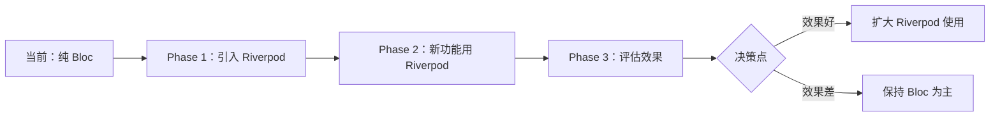

# 从事件驱动到命令式：架构转换深度评估报告

## 执行摘要

从 Bloc 的事件驱动架构转换到 Riverpod 的命令式架构，是一个**根本性的架构范式转变**。这不仅仅是状态管理工具的替换，而是整个应用程序设计哲学的改变。

**核心结论**：虽然技术上可行，但这种转换会带来深远的架构影响，需要重新思考整个应用的设计模式、错误处理、状态同步和团队开发流程。

---

## 一、架构范式对比

### 1.1 事件驱动架构（Event-Driven Architecture）- Bloc 模式

#### 核心理念
```
用户操作 → 事件 → 处理器 → 状态变化 → UI更新
```

#### 实际代码示例（来自 AppFlowy）
```dart
// ChatBloc - 事件定义
@freezed
class ChatEvent with _$ChatEvent {
  // 用户操作映射为事件
  const factory ChatEvent.sendMessage(
    String message,
    MessageFormat format,
    Map<String, dynamic>? metadata,
    String? promptId,
  ) = _SendMessage;
  
  const factory ChatEvent.stopStream() = _StopStream;
  const factory ChatEvent.regenerateAnswer(String id) = _RegenerateAnswer;
  const factory ChatEvent.loadPreviousMessages() = _LoadPreviousMessages;
}

// 事件处理 - 集中式处理逻辑
void _dispatch() {
  on<ChatEvent>((event, emit) async {
    await event.when(
      sendMessage: (message, format, metadata, promptId) async =>
        _handleSendMessage(message, format, metadata, promptId, emit),
      stopStream: () async => _handleStopStream(emit),
      regenerateAnswer: (id) async => _handleRegenerateAnswer(id, emit),
      // ... 20+ 种事件处理
    );
  });
}
```

#### 特征分析
1. **解耦性高**：UI 和业务逻辑完全分离
2. **可追溯性强**：每个状态变化都有对应事件
3. **时序控制精确**：事件按顺序处理，避免竞态条件
4. **测试友好**：可以单独测试事件处理逻辑

### 1.2 命令式架构（Imperative Architecture）- Riverpod 模式

#### 核心理念
```
用户操作 → 直接方法调用 → 状态更新 → UI更新
```

#### 转换后的代码示例
```dart
// ChatController - 直接方法调用
@riverpod
class ChatController extends _$ChatController {
  @override
  ChatState build() => ChatState.initial();
  
  // 直接暴露方法，而非事件
  Future<void> sendMessage(
    String message,
    MessageFormat format,
    Map<String, dynamic>? metadata,
    String? promptId,
  ) async {
    state = state.copyWith(isLoading: true);
    try {
      final result = await _messageService.send(message, format, metadata);
      state = state.copyWith(
        messages: [...state.messages, result],
        isLoading: false,
      );
    } catch (e) {
      state = state.copyWith(error: e.toString(), isLoading: false);
    }
  }
  
  void stopStream() {
    _streamManager.stop();
    state = state.copyWith(isStreaming: false);
  }
  
  Future<void> regenerateAnswer(String id) async {
    // 直接执行逻辑
    final message = state.messages.firstWhere((m) => m.id == id);
    await _regenerate(message);
  }
}
```

#### 特征分析
1. **直观简洁**：方法即行为，调用即执行
2. **响应快速**：减少中间层，直接更新状态
3. **代码量少**：无需定义事件和复杂的分发逻辑
4. **调试简单**：调用栈清晰，易于追踪

---

## 二、深度影响分析

### 2.1 架构层面影响

#### 失去的能力

| 能力 | 事件驱动（Bloc） | 命令式（Riverpod） | 影响程度 |
|------|-----------------|-------------------|----------|
| **事件重放** | ✅ 可以重放事件序列 | ❌ 无法重放 | 🔴 高 |
| **时间旅行调试** | ✅ 可回溯任意状态 | ❌ 仅当前状态 | 🟡 中 |
| **事件拦截** | ✅ 全局事件中间件 | ⚠️ 需要手动实现 | 🔴 高 |
| **审计日志** | ✅ 自动事件记录 | ⚠️ 需要额外代码 | 🟡 中 |
| **撤销/重做** | ✅ 基于事件栈 | ⚠️ 需要自定义实现 | 🔴 高 |

#### 获得的能力

| 能力 | 事件驱动（Bloc） | 命令式（Riverpod） | 优势程度 |
|------|-----------------|-------------------|----------|
| **代码简洁性** | ❌ 样板代码多 | ✅ 减少 40-50% | 🟢 高 |
| **学习成本** | ❌ 概念复杂 | ✅ 直观易懂 | 🟢 高 |
| **性能优化** | ⚠️ 额外开销 | ✅ 直接执行 | 🟡 中 |
| **热重载** | ⚠️ 事件需重新触发 | ✅ 状态保持 | 🟡 中 |

### 2.2 具体模块影响评估

#### 高影响模块（需要重新设计）

1. **数据库模块**（GridBloc、BoardBloc、CalendarBloc）
   - 当前：复杂的事件链处理（排序、过滤、分组）
   - 转换后：需要重新设计状态同步机制
   - 风险：**极高** - 可能导致数据不一致

2. **协同编辑**（DocumentSyncBloc）
   - 当前：基于事件的冲突解决
   - 转换后：失去事件顺序保证
   - 风险：**极高** - 影响多用户协作

3. **撤销/重做系统**
   - 当前：基于事件栈
   - 转换后：需要完全重写
   - 风险：**高** - 核心功能受影响

#### 中等影响模块

1. **AI 聊天**（ChatBloc）
   - 流式响应处理需要重新设计
   - 消息队列管理变复杂

2. **工作区管理**（WorkspaceBloc）
   - 状态切换逻辑需要重构
   - 权限验证流程改变

#### 低影响模块

1. **主题设置**（AppearanceCubit）
   - 简单状态，容易迁移
   
2. **用户设置**（SettingsBloc）
   - 独立功能，影响小

---

## 三、实际案例分析

### 案例 1：复杂事件链处理

**场景**：用户在数据库中执行过滤操作

#### Bloc 实现（现有）
```dart
// 事件链：用户操作 → 过滤事件 → 数据重载事件 → UI更新事件
class DatabaseBloc extends Bloc<DatabaseEvent, DatabaseState> {
  void _dispatch() {
    on<DatabaseEvent>((event, emit) async {
      await event.when(
        // 1. 接收过滤事件
        applyFilter: (filter) async {
          emit(state.copyWith(isLoading: true));
          
          // 2. 触发数据重载事件（事件链）
          add(const DatabaseEvent.reloadData());
          
          // 3. 保存过滤器
          await _saveFilter(filter);
        },
        
        // 4. 处理重载事件
        reloadData: () async {
          final data = await _loadFilteredData();
          
          // 5. 触发计算事件（事件链继续）
          add(DatabaseEvent.calculateAggregations(data));
        },
        
        // 6. 处理计算事件
        calculateAggregations: (data) async {
          final aggregations = await _calculate(data);
          emit(state.copyWith(
            data: data,
            aggregations: aggregations,
            isLoading: false,
          ));
        },
      );
    });
  }
}
```

#### Riverpod 实现（转换后）
```dart
@riverpod
class DatabaseController extends _$DatabaseController {
  // 需要手动管理复杂的操作链
  Future<void> applyFilter(Filter filter) async {
    state = state.copyWith(isLoading: true);
    
    try {
      // 手动编排操作顺序
      await _saveFilter(filter);
      final data = await _loadFilteredData();
      final aggregations = await _calculate(data);
      
      state = state.copyWith(
        data: data,
        aggregations: aggregations,
        isLoading: false,
      );
    } catch (e) {
      // 错误处理变得分散
      state = state.copyWith(error: e, isLoading: false);
    }
  }
}
```

**问题分析**：
1. 失去了事件链的清晰性
2. 操作顺序硬编码在方法中
3. 难以插入中间步骤
4. 错误处理变得复杂

### 案例 2：并发控制

**场景**：多个操作同时修改状态

#### Bloc 实现（现有）
```dart
class ViewBloc extends Bloc<ViewEvent, ViewState> {
  // Bloc 自动序列化事件，避免竞态条件
  void _dispatch() {
    on<ViewEvent>(
      (event, emit) async {
        // 事件按顺序处理，自动避免并发问题
        await event.when(
          rename: (name) => _rename(name, emit),
          delete: () => _delete(emit),
          move: (target) => _move(target, emit),
        );
      },
      // 可以配置并发处理策略
      transformer: sequential(), // 顺序处理
      // transformer: concurrent(), // 并发处理
      // transformer: droppable(), // 可丢弃
    );
  }
}
```

#### Riverpod 实现（转换后）
```dart
@riverpod
class ViewController extends _$ViewController {
  // 需要手动处理并发
  final _operationQueue = Queue();
  
  Future<void> rename(String name) async {
    // 手动实现队列控制
    await _operationQueue.add(() async {
      state = state.copyWith(isLoading: true);
      await _backendService.rename(viewId, name);
      state = state.copyWith(name: name, isLoading: false);
    });
  }
  
  Future<void> delete() async {
    await _operationQueue.add(() async {
      // 手动处理并发
    });
  }
}
```

**问题分析**：
1. 需要手动实现并发控制
2. 容易出现竞态条件
3. 代码复杂度增加

---

## 四、迁移风险矩阵

### 风险评估表

| 风险类别 | 风险等级 | 概率 | 影响 | 缓解策略 |
|---------|---------|------|------|----------|
| **架构一致性破坏** | 🔴 极高 | 90% | 严重 | 分阶段迁移，保持双轨 |
| **团队认知负担** | 🔴 高 | 80% | 严重 | 深度培训，编写指南 |
| **功能回归** | 🔴 高 | 70% | 严重 | 完整测试覆盖 |
| **性能问题** | 🟡 中 | 40% | 中等 | 性能监控，优化 |
| **维护成本增加** | 🟡 中 | 60% | 中等 | 建立新的最佳实践 |
| **第三方兼容** | 🟢 低 | 20% | 轻微 | 评估依赖，逐步替换 |

### 具体风险场景

#### 场景 1：事件顺序依赖
```dart
// 风险：某些功能依赖特定的事件执行顺序
// Bloc 保证顺序，Riverpod 需要手动管理
```

#### 场景 2：状态回滚
```dart
// 风险：无法回滚到之前的状态
// 影响：调试困难，用户体验下降
```

#### 场景 3：中间件功能
```dart
// 风险：失去全局事件拦截能力
// 影响：日志、分析、权限验证需要重新实现
```

---

## 五、决策建议

### 5.1 是否应该转换？

基于深度分析，我的建议是：

#### ❌ **不建议完全转换**，原因如下：

1. **架构契合度**：AppFlowy 的复杂业务逻辑更适合事件驱动
2. **功能损失**：失去的能力（事件重放、撤销/重做）对产品核心价值影响大
3. **成本效益**：迁移成本极高，收益不足以抵消风险
4. **团队影响**：需要重新培训，短期生产力大幅下降

#### ✅ **建议采用混合策略**：

1. **保留 Bloc 核心**：
   - 数据库模块
   - 文档编辑器
   - 协同功能
   - 复杂状态机

2. **Riverpod 用于新功能**：
   - 简单 CRUD 操作
   - UI 组件状态
   - 本地设置管理
   - 独立功能模块

### 5.2 架构演进路线图



### 5.3 最佳实践建议

#### 如果决定部分迁移：

1. **建立适配层**
```dart
// 创建统一接口，屏蔽底层差异
abstract class StateManager<T> {
  Stream<T> watch();
  T read();
  void dispatch(Action action);
}

class BlocStateManager<T> implements StateManager<T> { }
class RiverpodStateManager<T> implements StateManager<T> { }
```

2. **保持架构一致性**
```dart
// 即使使用 Riverpod，也保持类似事件的方法命名
class Controller {
  void onUserTapSend() { } // 而非 sendMessage()
  void onFilterApplied() { } // 而非 applyFilter()
}
```

3. **实现事件日志**
```dart
// 在 Riverpod 中手动实现事件追踪
mixin EventLogging on StateNotifier {
  void logEvent(String event, Map<String, dynamic> params) {
    // 记录操作日志
  }
}
```

---

## 六、结论

从事件驱动架构转向命令式架构是一个**重大的架构决策**，不应该仅基于代码简洁性或流行趋势做出。

### 核心观点：

1. **架构范式的选择应该基于业务需求**，而非技术偏好
2. **AppFlowy 的复杂性更适合事件驱动架构**
3. **混合使用是更务实的选择**
4. **保持架构一致性比追求技术统一更重要**

### 最终建议：

**维持 Bloc 作为主要架构，谨慎引入 Riverpod 用于特定场景**。这样可以：
- 保持现有架构的稳定性
- 逐步积累 Riverpod 经验
- 避免大规模重构的风险
- 为未来的架构演进保留灵活性

---

*报告完成时间：2025-08-09*
*评估深度：架构级*
*建议等级：战略性*