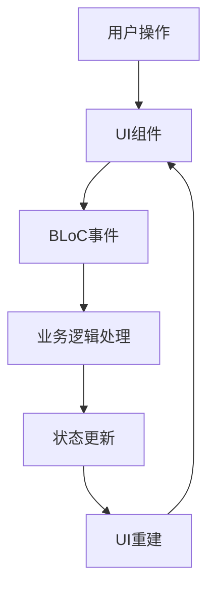

# AppFlowy 移动端组件架构说明

## 📱 组件层级结构

```
MobileHomeScreen (入口屏幕)
├── 初始化工作区和用户信息
└── MobileHomePage (主页容器)
    ├── MobileHomePageHeader (顶部头部)
    │   ├── _MobileUser (个人工作区模式)
    │   │   ├── 用户头像
    │   │   └── 用户信息
    │   ├── _MobileWorkspace (协作工作区模式)
    │   │   ├── 工作区图标
    │   │   └── 工作区名称
    │   └── HomePageSettingsPopupMenu (设置菜单)
    │
    └── MobileHomePageTab (Tab主体)
        ├── MobileSpaceTabBar (Tab栏)
        │   ├── 可拖拽排序
        │   └── 圆角下划线指示器
        │
        └── TabBarView (Tab内容)
            ├── MobileRecentSpace (最近访问)
            │   └── 最近访问的文档列表
            ├── MobileHomeSpace (空间页面)
            │   ├── MobileFolders (文件夹容器)
            │   │   ├── MobileSpace (空间模式)
            │   │   └── MobileSectionFolder (文件夹模式)
            │   └── FloatingAIEntryV2 (AI悬浮按钮)
            ├── MobileFavoriteSpace (收藏夹)
            │   └── 收藏的文档列表
            └── MSharedSection (共享内容)
                └── 共享的文档列表
```

## 🔄 状态管理关系

```
UserWorkspaceBloc (工作区管理)
├── 管理当前工作区
├── 处理工作区切换
└── 工作区操作（创建/删除/重命名）

SpaceOrderBloc (Tab顺序管理)
├── Tab排序持久化
├── 记录默认Tab
└── 处理拖拽重排序

SpaceBloc (空间管理)
├── 空间列表管理
├── 空间创建/删除
└── 页面导航

SidebarSectionsBloc (侧边栏部分管理)
├── 公共/私有文件夹
├── 收藏夹
└── 最近访问

FavoriteBloc (收藏管理)
└── 收藏/取消收藏操作

RecentViewsBloc (最近访问管理)
└── 最近访问记录
```

## 🎯 核心交互流程

### 1. 应用启动流程
- `MobileHomeScreen` 获取工作区和用户信息
- 初始化各种 BLoC 提供器
- 根据工作区类型显示不同的头部

### 2. Tab 切换流程
- `SpaceOrderBloc` 加载用户的 Tab 偏好
- `TabController` 管理 Tab 切换
- 记录最后打开的 Tab

### 3. 内容显示逻辑
- **个人工作区**：显示用户信息 + 个人文件夹
- **协作工作区**：显示工作区信息 + 公共/私有文件夹
- **空间模式**：优先显示空间列表

### 4. 快速创建流程
- 全局通知器触发创建
- 优先在空间中创建
- 创建后自动导航到新页面

## 📁 文件位置映射

### 核心组件
- **入口屏幕**: `mobile_home_page.dart`
- **头部组件**: `mobile_home_page_header.dart`
- **Tab容器**: `tab/mobile_space_tab.dart`
- **Tab栏**: `tab/_tab_bar.dart`

### Tab 内容页面
- **最近访问**: `recent_folder/recent_space.dart`
- **空间页面**: `home_space/home_space.dart`
- **收藏夹**: `favorite_folder/favorite_space.dart`
- **共享内容**: `features/shared_section/presentation/m_shared_section.dart`

### 文件夹相关
- **文件夹容器**: `mobile_folders.dart`
- **空间列表**: `space/mobile_space.dart`
- **部分文件夹**: `section_folder/mobile_home_section_folder.dart`

### 状态管理
- **工作区管理**: `workspace/application/user/user_workspace_bloc.dart`
- **Tab顺序**: `tab/space_order_bloc.dart`
- **空间管理**: `workspace/application/sidebar/space/space_bloc.dart`
- **侧边栏部分**: `workspace/application/menu/sidebar_sections_bloc.dart`

## 🔧 特殊功能

### AI 悬浮按钮
- 仅在服务器工作区的空间 Tab 显示
- 位置：右下角固定悬浮
- 文件：`ai_bubble_button.dart`

### Tab 拖拽排序
- 使用 `ReorderableTabBar` 组件
- 支持长按拖拽重新排序
- 排序结果持久化存储

### 工作区切换
- 点击头部工作区信息触发
- 底部弹出菜单选择
- 支持创建、切换、删除工作区

### 状态保持
- 使用 `AutomaticKeepAliveClientMixin`
- 保持 Tab 切换时的页面状态
- 避免重复加载数据

## 🌟 设计特点

1. **清晰的层级结构**：组件层级分明，职责单一
2. **灵活的状态管理**：使用 BLoC 模式，解耦展示层和业务逻辑
3. **响应式设计**：根据工作区类型动态调整UI
4. **用户体验优化**：支持个性化设置和状态保持
5. **模块化设计**：各功能模块独立，便于维护和扩展

## 🔄 数据流向



## 📝 注意事项

1. **Tab 类型枚举顺序不可更改**：索引值会被持久化存储
2. **工作区切换会重置状态**：需要重新初始化相关 BLoC
3. **空间模式优先级高于文件夹模式**：有空间时不显示传统文件夹
4. **全局通知器用于跨组件通信**：如快速创建文档等操作

## 🚀 扩展建议

1. **添加新 Tab**：
   - 在 `MobileSpaceTabType` 枚举添加新类型
   - 在 `_buildTabs` 方法添加对应组件
   - 更新本地化文本

2. **自定义 Tab 样式**：
   - 修改 `MobileSpaceTabBar` 组件
   - 调整 `RoundUnderlineTabIndicator` 指示器

3. **增加新的状态管理**：
   - 创建新的 BLoC
   - 在 `MobileHomePage` 添加 Provider
   - 连接相应的 UI 组件